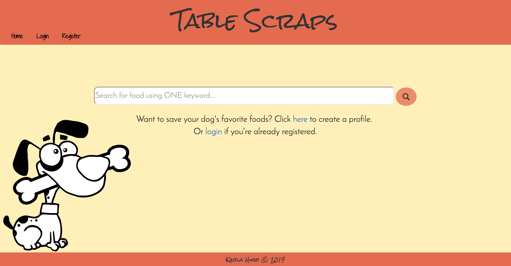

Table Scraps
============
Table Scraps is a full-stack web application allowing dog lovers to search a database to find out whether or not a human food is safe for dog consumption. This application allows users to utilize search functionality without logging in and provides additional features to those who choose to create an account.

The home page consists of a search bar and options to register or login. When a user searches for a food, they are redirected to a results page displaying whether or not the food is safe for dog consumption and more information about harms and/or benefits related to consumption of this food.

Registered users create a profile for their dog which allows them to save foods to their dog’s profile (on button click) to indicate whether or not their dog likes this food.

Installation
------------
* Install dependencies with `npm install`
* There will be no items in the database, but basic functionality can be tested.

Technologies Used
-----------------
* Mongodb
* Mongoose
* Express.js
* AngularJS
* Node.js
* Passport
* bcrypt
* HTML5
* CSS3
* Bootstrap

Coming Soon
-----------
* Deployment to Heroku
* Upload profile picture
* Add multiple dogs to one profile
