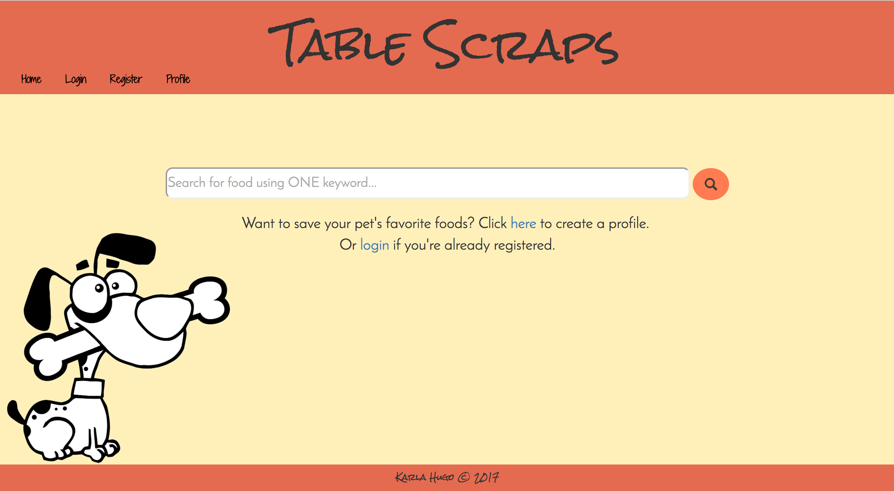

Table Scraps
============
Table Scraps (name subject to change) is a full-stack web application allowing dog owners to search a database to find out whether or not a human food is safe for dog consumption. This application allows users to utilize search functionality without logging in and provides additional features to those who choose to create an account.

The home page consists of a search bar and options to register or login. When a user searches for a food, they are redirected to a results page displaying whether or not the food is safe for dog consumption and more information about harms or benefits related to consumption of this food.

Registered users create a profile for their dog which allows them to save individual foods to their dog’s profile (by selecting icons) to indicate whether or not their dog likes this food.

Installation
------------
* Install the following dependencies using `npm install` :
 - angular
 - angular-route
 - bcrypt
 - body-parsser
 - bootstrap
 - express
 - express-session
 - mongoose
 - ng-dialog
 - passport
 - passport-local

Technologies Used
-----------------
* Mongodb
* Mongoose
* Express.js
* AngularJS
* Node.js
* Passport
* bcrypt
* HTML5
* CSS3
* Bootstrap

Coming Soon
-----------
* Upload profile picture
* Rearrange likes/dislikes
* Add multiple dogs to one profile

]
